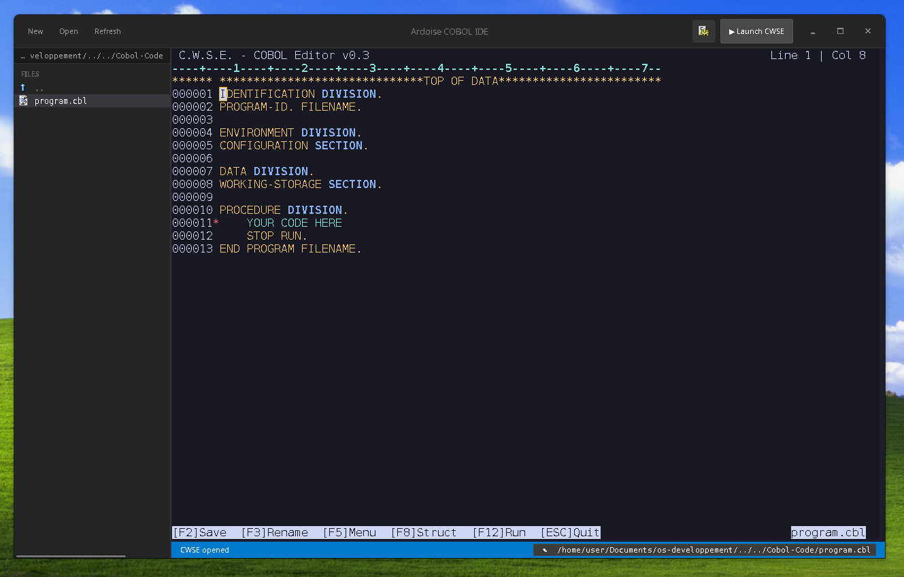

## Ardoise Cobol IDE

This is a simple code editor that use the [C.W.S.E. TUI Cobol Editor](https://github.com/EntoNine/C.W.S.E.-Cobol-Work-Script-Editor) integrated in a modern GUI. 


Using GTK, made entirely in C. 



Other requirement: GnuCobol 

&ensp;

Compile command for Linux:

```bash
gcc cwse_ide.c cwse.c resources.c -o cwse_studio $(pkg-config --cflags --libs gtk4 vte-2.91-gtk4) -lncurses

```

